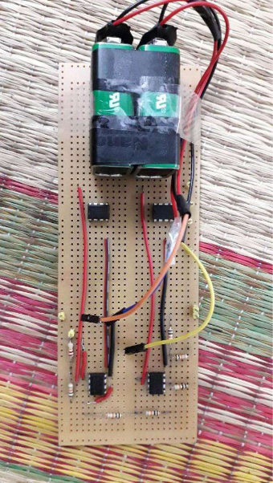
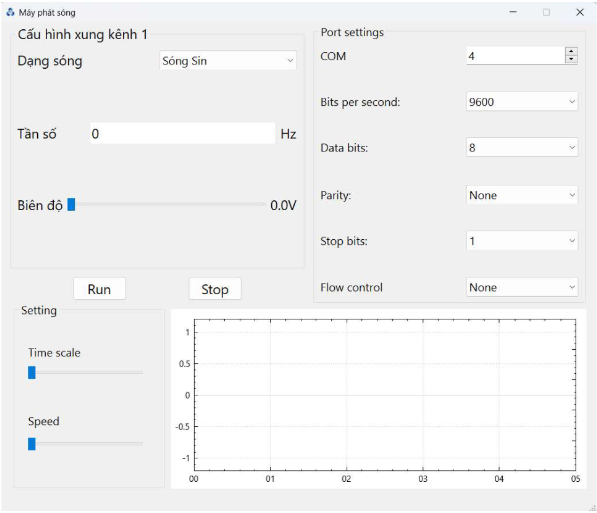

# CREATING WAVE FORM 
I create wave formation by using STM32 microcontroller and amplify them up to 3 time.
Drawing them in GUI, that is coded by C++ in Qt.

## IMAGES FOR PROJECT
 
Image Hardware

 
Image GUI Qt

